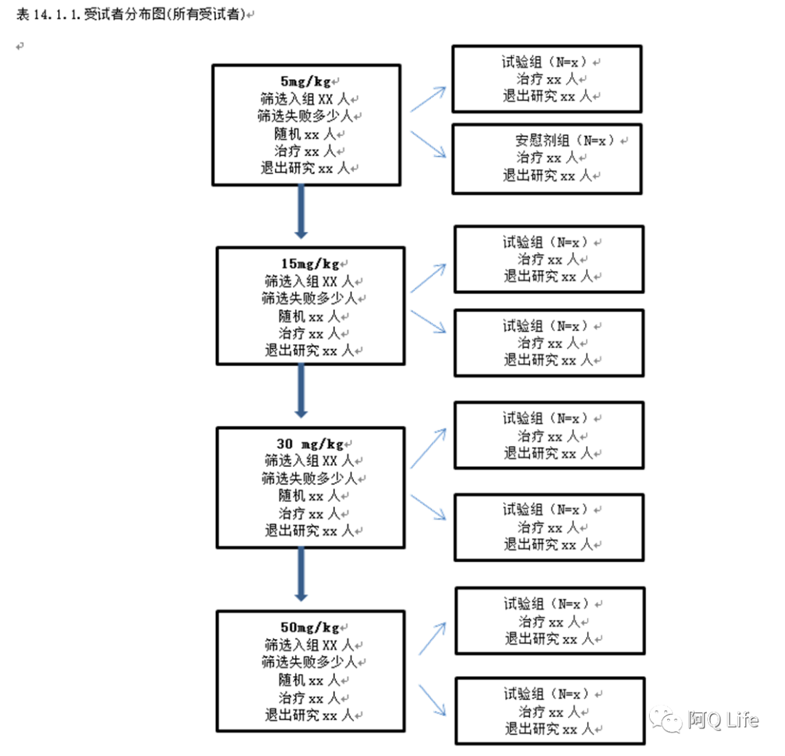
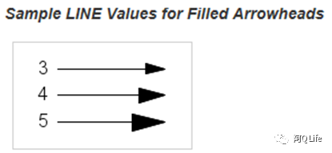
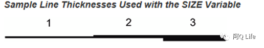
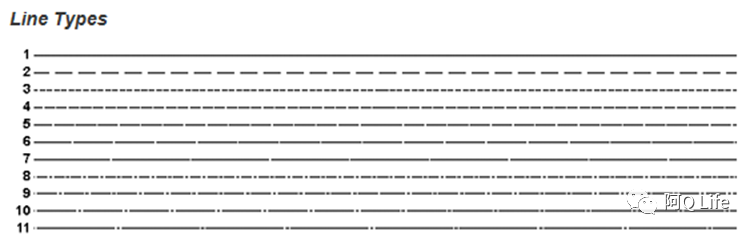
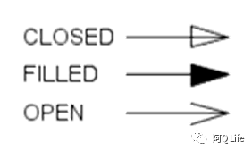
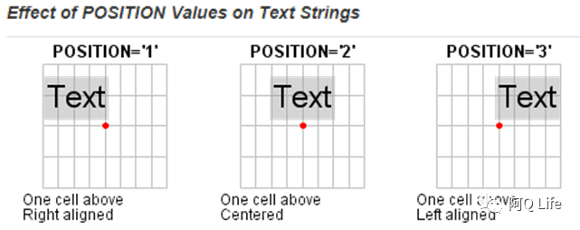
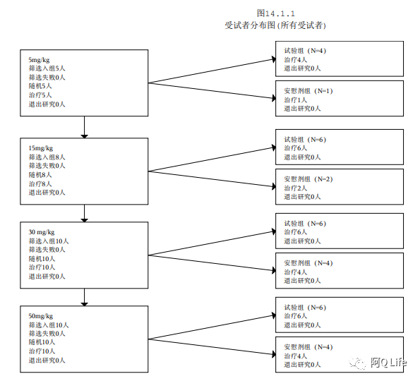

---
categories:
- SAS
- FlowChart
date: '2021-12-13'
draft: false
lastmod: "2021-12-13"
tags:
- SAS
- Graph
title: SAS绘制流程图
---



CSR中的第一张表格往往会是一张流程图，那么使用SAS如何绘制流程图，我们一起来看看。

SAS ANNOTATION FUNCTIONS:
```SAS
%annomac;
```
|Macro to use|Tasks|
|:--|:--|
|%ARROW(x1, y1, x2, y2, color, line, size, angle, style); |Draw an arrow
|%RECT(x 1,y 1,x 2,y 2, color, line, size); |Draw a rectangle|
|%LABEL(x, y, text, color, angle, rotate, size, style, position); |Draw text|

%ARROW(x1, y1, x2, y2, color, line, size, angle, style); 
Function: Draws an arrow from (X1, Y1) to (X2,Y2).
Parameter
line: specifies the length of the sides of the arrowhead


size: specifies the width of the line


angle: specifies the angle of the tip of the arrowhead

style:specifies the type of arrowhead


%RECT(x 1,y 1,x 2,y 2, color, line, size);
Function: Draws a rectangle with diagonal corners at two specified points. 
Parameters

line: specifies the rectangle's line type



%LABEL(x, y, text, color, angle, rotate, size, style, position); 
Function: Places a text label at the specified coordinates
Parameters
angle: specifies the angle of the text string with respect to the horizontal
rotate: specifies the rotation angle of each character in the text string
size: specifies the size of the text string
style: specifies the text font
position: specifies the placement and alignment



```SAS
%macro add_element(x=,y=,width=,height=,text=);
 %rect(&x,&y,&x+&width,&y+&height,black,1,1);
 %let i=1;
 %do %until (%qscan(&text,&i,'|')=);
 %label(&x+1,&y+&height-2*&i,"%qscan(&text,&i,'|')",BLACK,0,0,1.5,SimSun,6);
 %let i=%eval(&i+1);
 %end;
%mend add_element; 


data final;
 length function color style $8. text $60.;
 retain xsys '3' ysys '3' hsys '3' when 'a' line 1 function 'label';

 %add_element(x=10,y=83,width=20,height=15,text=%str( 5mg/kg | 筛选入组&scrn1.人 | 筛选失败&scrnf1.人 | 随机&rand1.人 | 治疗&treat1.人 | 退出研究&disc1.人 ));
 %add_element(x=50,y=92,width=20,height=8,text=%str( 试验组（N=&n1.）| 治疗&t1.人 | 退出研究&d1.人 ));
 %add_element(x=50,y=83,width=20,height=8,text=%str( 安慰剂组（N=&n2.）| 治疗&t2.人 | 退出研究&d2.人 ));

 %add_element(x=10,y=63,width=20,height=15,text=%str( 15mg/kg | 筛选入组&scrn2.人 | 筛选失败&scrnf2.人 | 随机&rand2.人 | 治疗&treat2.人 | 退出研究&disc2.人 ));
 %add_element(x=50,y=72,width=20,height=8,text=%str( 试验组（N=&n3.）| 治疗&t3.人 | 退出研究&d3.人 ));
 %add_element(x=50,y=63,width=20,height=8,text=%str( 安慰剂组（N=&n4.）| 治疗&t4.人 | 退出研究&d4.人 ));

 %add_element(x=10,y=44,width=20,height=15,text=%str( 30 mg/kg | 筛选入组&scrn3.人 | 筛选失败&scrnf3.人 | 随机&rand3.人 | 治疗&treat3.人 | 退出研究&disc3.人 ));
 %add_element(x=50,y=53,width=20,height=8,text=%str( 试验组（N=&n5.）| 治疗&t5.人 | 退出研究&d5.人 ));
 %add_element(x=50,y=44,width=20,height=8,text=%str( 安慰剂组（N=&n6.）| 治疗&t6.人 | 退出研究&d6.人 ));

 %add_element(x=10,y=25,width=20,height=15,text=%str( 50mg/kg | 筛选入组&scrn4.人 | 筛选失败&scrnf4.人 | 随机&rand4.人 | 治疗&treat4.人 | 退出研究&disc4.人 ));
 %add_element(x=50,y=34,width=20,height=8,text=%str( 试验组（N=&n7.）| 治疗&t7.人 | 退出研究&d7.人 ));
 %add_element(x=50,y=25,width=20,height=8,text=%str( 安慰剂组（N=&n8.）| 治疗&t8.人 | 退出研究&d8.人 ));

 /*** CONNECTING LINES... ***/
 %arrow(20,83,20,78,BLACK,1,0.1,90,filled);
 %arrow(20,63,20,59,BLACK,1,0.1,90,filled);
 %arrow(20,44,20,40,BLACK,1,0.1,90,filled);

 %arrow(30,90.5,50,96,BLACK,1,0.1,90,filled);
 %arrow(30,90.5,50,87,BLACK,1,0.1,90,filled);

 %arrow(30,70.5,50,76,BLACK,1,0.1,90,filled);
 %arrow(30,70.5,50,67,BLACK,1,0.1,90,filled);

 %arrow(30,51.5,50,57,BLACK,1,0.1,90,filled);
 %arrow(30,51.5,50,48,BLACK,1,0.1,90,filled);

 %arrow(30,32.5,50,38,BLACK,1,0.1,90,filled);
 %arrow(30,32.5,50,29,BLACK,1,0.1,90,filled);

run;

/******
retain xsys '3' ysys '3' hsys '3’;
specify graphics output area
******/

/* displays Annotate graphics */
proc gslide annotate=final;
quit;
```
最后看一下我们输出的流程图。


从上面的代码中可以看出，我们需要标记清楚每一个点的坐标，但是这样无疑是很复杂的，所以SAS虽然可以实现绘制流程图，但是并不建议临床项目当中使用SAS来绘制。