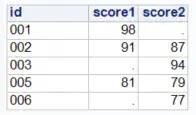

---
categories:
- SAS
- SAS Advance
- SAS SQL
date: '2021-11-12'
description: ""
tags:
- SAS
- SQL
title: SAS SQL（二）：横向合并的逻辑
---

学习SAS语法，需要进行数据集的横向合并，首先接触到的都是 Merge 语句，常见用法如下。
```SAS
data combine_dataset;
    merge dataset1 dataset2;
    by key_variable;
run;
```
那么使用SAS SQL同样也可以进行横向合并。
使用 DATA Step 的 merge 语句横向合并，是基于 PDV，逐行读取、匹配、输出观测，而 SAS SQL 的逻辑则不同。
在 [SAS SQL（一）：语法顺序与执行顺序](https://aqlife.netlify.app/post/sas/sas-sql-1/) 中提到 SQL 语句的 FROM 是首先执行的语句，而在 FROM 语句执行的过程中，可以认为还有三个步骤。
1. cartesian product，笛卡尔积
2. on，on 用于 key variable 匹配
3. outerjoin，外部连接

我们运行如下程序。
```SAS
data dataset1;
	input id1 $ score1;
	cards;
	001 98
	002 91
	005 81
	;
run;

data dataset2;
	input id2 $ score2;
	cards;
	002 87
	003 94
	005 79
	006 77
	;
run;

proc sql;
	select coalescec(a.id1, b.id2) as id, 
			score1, 
			score2 
		from dataset1 a 
		full join dataset2 b 
		on a.id1=b.id2;
quit;
```
得到结果如图。



采用的是 full join 的连接方式，但最终结果是5条观测，按照上面 FROM 语句的三个步骤。
1. 形成笛卡尔积，一共是12条观测。
2. on，通过 id1，id2 两个 variable 进行匹配，保留下来的是2条观测
3. outer join 是 full join，那么既要保留 dataset1 中没有匹配上的观测（1条观测）和 dataset2 中没有匹配上的观测（2条观测）

所以最终得到的结果就是 2+1+2=5 条观测。

