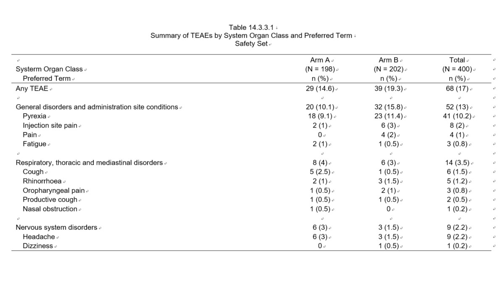

```{r setup, include=FALSE}
knitr::opts_chunk$set(fig.align = "center", echo = TRUE)
```

在临床试验有关不良事件（AE）的安全性分析中，TEAE by SOC and PT的table较为常见，我们尝试用R来完成分析并输出report.

今天重点介绍的R package: r2rtf 用于生成TFLs RTF.

```{r echo=TRUE, message=FALSE, warning=FALSE, attr.source='.numberLines'}
rm(list = ls())
library(plyr)
library(tidyverse)
library(haven)
library(r2rtf) #generate the TFLs report
```

读取需要用到的ADaM数据集。

```{r, attr.source='.numberLines'}
adsl <- read_sas("adsl.sas7bdat")
adae <- read_sas("adae.sas7bdat")
```

下列变量是ADSL和ADAE中需要用到的变量的label.

|ADaM|Variable|Label|
|--|--|--|
|ADSL/ADAE|USUBJID|Unique Subject Identifier|
|ADSL/ADAE|SAFFL|Safety Population Flag|
|ADSL|TRT01AN|Actual Treatment for Period 01(N)|
|ADAE|TRTAN|Actual Treatment (N)|
|ADAE|AEBODSYS|Body System or Organ Class|
|ADAE|AEDECOD|Dictionary-Derived Term|

通过ADSL计算安全性分析人群的(N = XX)

```{r, attr.source='.numberLines'}
#calculate big N from ADSL
bign <- rbind.fill(filter(adsl,
                           SAFFL == "Y"),
                    filter(mutate(adsl,
                                  TRT01AN = 9),
                           SAFFL == "Y")) %>% 
  group_by(TRT01AN) %>% 
  dplyr::summarise(bign = n_distinct(USUBJID)) %>% 
  dplyr::rename(TRTAN = TRT01AN)
```

为ADAE生成合计（Total）的分组。

```{r, attr.source='.numberLines'}
adae1 <- rbind.fill(filter(adae,
                           SAFFL == "Y"), 
                    filter(mutate(adae,
                                  TRTAN = 9),
                           SAFFL == "Y"))
```

计算TEAE table的第一行 Any TEAE的频数。

```{r, attr.source='.numberLines'}
#calculate the freq for any teae
teae_any <- adae1 %>% 
  group_by(TRTAN) %>% 
  dplyr::summarise(n = n_distinct(USUBJID)) %>% 
  ungroup() %>% 
  mutate(ord = 0,
         ord_soc = 0,
         AEBODSYS = "Any TEAE")
```

计算每个SOC的频数，需要注意SOC按照例数的倒序排序。

```{r, attr.source='.numberLines'}
#calculate the freq by SOC 
teae_soc <- adae1 %>% 
  group_by(TRTAN, AEBODSYS) %>% 
  dplyr::summarise(n = n_distinct(USUBJID)) %>% 
  ungroup()

teae_soc_ord <- teae_soc %>% 
  filter(TRTAN == 9) %>% 
  arrange(desc(n), AEBODSYS) %>% 
  mutate(ord_soc = row_number())

teae_soc1 <- left_join(teae_soc, 
                       select(teae_soc_ord, AEBODSYS, ord_soc),
                       by = c("AEBODSYS")) %>% 
  mutate(ord = 1)
```

计算每个SOC and PT的频数，同样需要注意按照SOC，PT的倒序排序。

```{r, attr.source='.numberLines'}
#calculate the freq by SOC and PT 
teae_pt <- adae1 %>% 
  group_by(TRTAN, AEBODSYS, AEDECOD) %>% 
  dplyr::summarise(n = n_distinct(USUBJID)) %>% 
  ungroup()

teae_pt_ord <- teae_pt %>% 
  filter(TRTAN == 9) %>% 
  left_join(select(teae_soc_ord,AEBODSYS, ord_soc),
            by = c("AEBODSYS")) %>% 
  arrange(ord_soc, desc(n), AEDECOD) %>% 
  mutate(ord_pt = row_number())


teae_pt1 <- left_join(teae_pt,
                      select(teae_pt_ord, AEBODSYS, AEDECOD, ord_soc, ord_pt),
                      by = c("AEBODSYS", "AEDECOD")) %>% 
  mutate(ord = 2) %>% 
  arrange(ord_soc, ord_pt)
```

合并形成最终的数据集，并计算百分比。

```{r, attr.source='.numberLines'}
#combine SOC and PT
final <- rbind.fill(teae_any, teae_soc1, teae_pt1) %>% 
  left_join(bign,
            by = c("TRTAN")) %>% 
  mutate(percent = round(100*n/bign, 1),
         col = str_c(as.character(n),
               " (",
               as.character(percent),
               ")"),
         item = case_when(is.na(AEDECOD) ~ AEBODSYS,
                          TRUE ~ str_c("  ", AEDECOD))) %>% 
  pivot_wider(id_cols = c(item, ord, ord_soc, ord_pt),
              names_from = TRTAN,
              values_from = col,
              names_prefix = "col",
              values_fill = "0") %>% 
  arrange(ord_soc, ord, ord_pt) %>% 
  group_split(ord_soc) %>% 
  map_dfr(~add_row(.x, .after = Inf)) %>% 
  select(item, col1, col2, col9)
```

由于report中需要输出(N = XX)，提前做一个object.

```{r, attr.source='.numberLines'}
colhead_bign <- bign %>% 
  mutate(header = str_c("(N = ", as.character(bign), ")"))

colhead_bign <- str_c("Systerm Organ Class",
        str_c(pull(colhead_bign, header), collapse = "|"), sep = "|")
```

通过r2rtf 定制table的样式，并输出RTF文件。

```{r, attr.source='.numberLines'}
#TFLs report
report <- final %>% 
  rtf_page(nrow = 25,
           orientation = "landscape",
           border_first = "single",
           border_last = "single") %>% 
  rtf_title(
    title = c(
      "Table 14.3.3.1",
      "Summary of TEAEs by System Organ Class and Preferred Term",
      "Safety Set"
    ),
    text_font_size = 9,
    text_font = 4  #Arial
  ) %>% 
  rtf_footnote(
    footnote = c(
      "Abbreviations: TEAE = Treatment-emergent adverse event.",
      "Note: MedDRA Version 25.1."
    ),
    text_font = 4, #Arial
    as_table = FALSE
  ) %>% 
  rtf_colheader(
    colheader = " | Arm A | Arm B | Total",
    col_rel_width = c(4, rep(1, 3)),
    text_justification = c("l", rep("c", 3)),
    border_left = NULL,
    border_right = NULL,
    text_font = 4
  ) %>% 
  rtf_colheader(
    colheader = colhead_bign,
    col_rel_width = c(4, rep(1, 3)),
    text_justification = c("l", rep("c", 3)),
    border_top = NULL,
    border_left = NULL,
    border_right = NULL,
    text_font = 4
  ) %>% 
  rtf_colheader(
    colheader = "{^\\s} {^\\s} Preferred Term | n (%) | n (%) | n (%)",
    col_rel_width = c( 4, rep(1, 3)),
    text_justification = c("l", rep("c", 3)),
    text_indent_first = 2,
    border_top = NULL,
    border_left = NULL,
    border_right = NULL,
    text_font = 4
  ) %>% 
  rtf_body(text_justification = c("l", rep("c", 3)),
           col_rel_width = c( 4, rep(1, 3)),
           text_font = 4,
           border_left = NULL,
           border_right = NULL) %>%
  rtf_source(
    source = "[Source: Listing 16.2.7 Adverse Event]",
    text_justification = "l",
    text_font = 4,
    as_table = FALSE
  ) %>% 
  rtf_encode() %>% 
  write_rtf("t_14_3_3_1.rtf")
```

最后是成果展示了。



