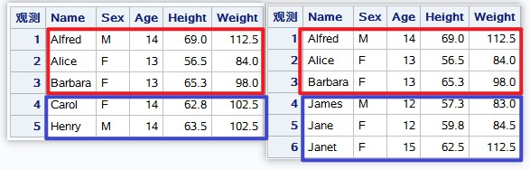

<!--more-->


# Dataset Preparation
我们直接使用熟悉的**SASHELP.CLASS**作为测试数据集。
```sas
data class1;
  set sashelp.class;
  if _n_<=5;
run;
proc print;run;

data class2;
  set sashelp.class;
  if _n_<=3 or _n_ in (6 7 8);
run;
proc print;run;
```

如下图所示，红色部分为**CLASS1**和**CLASS2**两个数据集之间相同的观测，蓝色部分为两者之间不同的观测。



# 方法一：DATA STEP
在DATA STEP中，如果想要得到**CLASS2**相比**CLASS1**有更新的观测，可以通过：
```sas
proc sort data=class1;by _all_;run;
proc sort data=class2;by _all_;run;

data update_row;
	merge class1(in=a) class2(in=b);
	by _all_;
	if b and ^a;
run;
proc print;run;
```
如果想要得到两个数据集之间共同的观测，也很简单：
```sas
data common_row;
	merge class1(in=a) class2(in=b);
	by _all_;
	if a and b;
run;
proc print;run;
```

# 方法二：PROC SQL
那么在PROC SQL中该如何实现上述的功能呢？常规方法的比如inner join，left join就可以实现， 而这里的方法是需要介绍两个operator，**EXCEPT**与**INTERSECT**。
```sas
proc sql;
	select * from class2
		except select * from class1;
quit;

proc sql;
	select * from class2
		intersect select * from class1;
quit;
```

# 方法三：SAS Hash
使用**HASH**对象来找出来两者之间的异同。
```sas
data update_row2;
	if _n_=1 then do;
		declare hash h(dataset:"class1", ordered:"yes");
		h.defineKey(all:"yes");
		h.defineData(all:"yes");
		h.defineDone();
	end;
	set class2;
	if h.find() ne 0;
run;

data common_row2;
	if _n_=1 then do;
		declare hash h(dataset:"class1", ordered:"yes");
		h.defineKey(all:"yes");
		h.defineData(all:"yes");
		h.defineDone();
	end;
	set class2;
	if h.find() = 0;
run;
```

