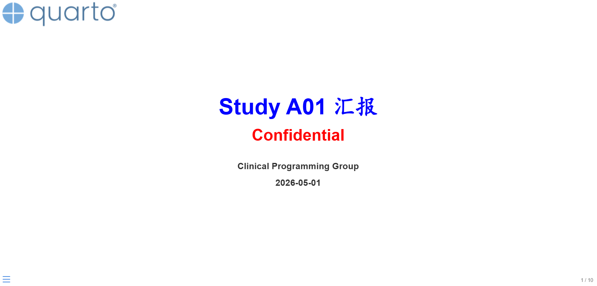
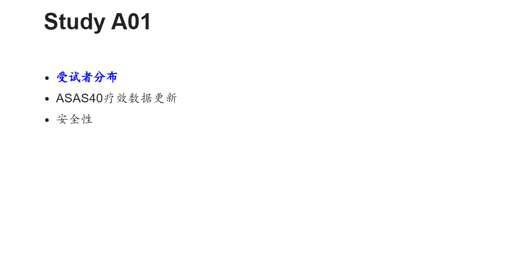
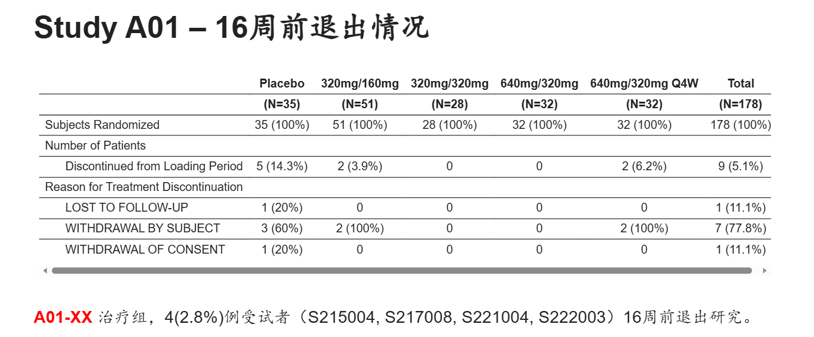
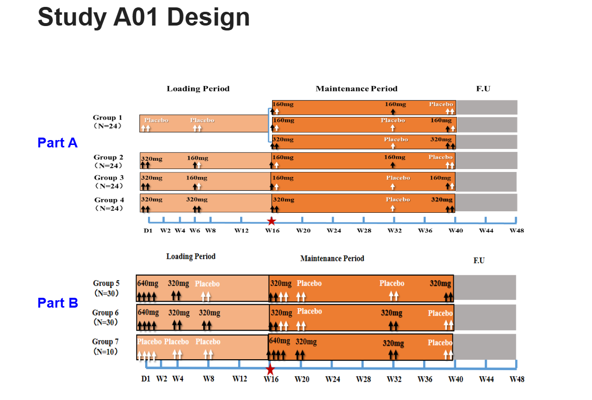
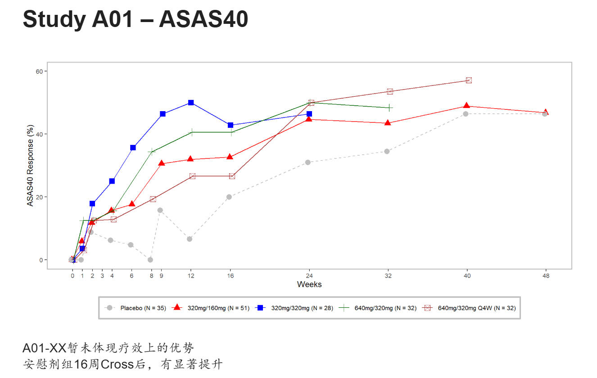
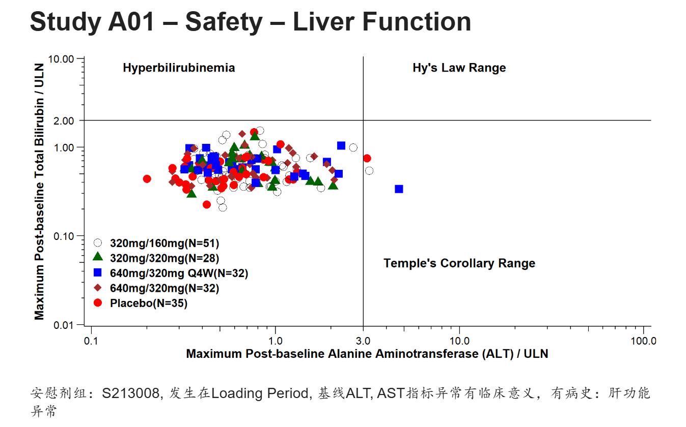

Clinical Programmer经常会为统计，医学输出一些TLGs，特别是Graph，用于制作PPT，方便给老板汇报。如果我们可以直接用Quarto通过R代码制作Presentation肯定是个不错的尝试。 Quarto支持多种演示文稿的格式，其中reveal.js是目前最强大的演示文稿的格式，可以以HTML幻灯片展示。相比传统PPT，支持R Markdown语法，代码高亮展示，实时交互，主题控制，占用内存较小等等优势。 下面利用测试数据，模拟给老板汇报，来做一个presentation.

## 前期准备

1.  制作presentation之前需要准备好临床研究所需的数据，最好是ADaM数据集，方便后续直接调用生成presentation中图表。
2.  Presentation中需要用到的图片（公司logo，来自Protocol的截图等等）。

## 标题页

``` r
---
title: "Study A01 汇报"
subtitle: "Confidential "
date: "2026.05.01"
author: "Clinical Programming Group"
format:
  revealjs:
    slide-number: true
    chalkboard: 
      buttons: false
    preview-links: auto
    title-slide-attributes:
      data-background-image: images/quarto.png  
      data-background-size: "20%"        
      data-background-position: "top left"  
    scrollable: true
    css: custom.css
editor: visual
---
```



设置presentation的标题，副标题等等，图中左上角使用quarto的logo用来模拟企业自己的商标，标题，副标题的颜色属性是放到 custom.css 中设置的，这一点下文再给大家展示。

## 目录页

``` r
## Study A01
<br/>

- [**受试者分布**]{style="color: blue;"}
- ASAS40疗效数据更新
- 安全性
```

 颜色，字体都可以通过style进行自定义。

## Table表格页

``` r
## Study A01 -- 16周前退出情况

library(haven)
library(tidyverse)
library(rtables)
library(tern)
library(htmltools)

adsl <- read_sas("data/adsl.sas7bdat") %>% 
  filter(ITTFL == "Y") %>% 
  mutate(TRTP = TRT01P, TRTPN = TRT01PN) %>% 
  mutate(randflag = TRUE %>% with_label("Subjects Randomized"),

         flag3 = (DCS01RS != "") %>% with_label("Discontinued from Loading Period"),
         DCS01RS = as.factor(ifelse(DCS01RS == "", NA, DCS01RS)),
         TRTP = forcats::fct_reorder(TRTP, TRTPN)
  ) 
 

tfl_disp <- basic_table(
            show_colcounts = TRUE, # 展示big N
            inset = 2) %>% 
  split_cols_by("TRTP") %>%  #设置列的子分组
  add_overall_col("Total") %>%
  count_patients_with_flags(
    "USUBJID",
    flag_variables = c("randflag"),
    denom = "N_col",
    table_names = "count1"
  ) %>% 
  count_patients_with_flags(
    "USUBJID",
    flag_variables = grep("^flag", names(adsl), value = TRUE),
    var_labels = "Number of Patients",
    show_labels = "visible",
    denom = "N_col",
  ) %>% 
  analyze_vars(vars = c("DCS01RS"),
               .stats = "count_fraction",
               var_labels = c("Reason for Treatment Discontinuation"),
               ) %>% 
  build_table(adsl, alt_counts_df= adsl)

as_html(tfl_disp) %>% 
  tagAppendAttributes(style = "font-size: 0.7em; wdth: 100%;",
                      .cssSelector = "table") %>% 
  tagList()

<br/br/> [**A01-XX**]{style="color: red;"} 治疗组，4(2.8%)例受试者（S215004, S217008, S221004, S222003）16周前退出研究。
```

上面的代码就是输出常规的受试者分布表的R代码，rtables和tern package对于输出TLGs非常好用。可以看到上图输出的表格下面有左右滚动条，对于试验前期探索阶段的项目可能有多个组别，这里相比PPT可以很好的适应多列的情况，而不用调整字体。

## 试验设计页

``` r
## Study A01 Design

::: {style="height: 150px;"}
:::

[**Part A**]{style="color: blue;"}

::: {style="height: 220px;"}
:::

[**Part B**]{style="color: blue;"}

{.absolute top="100" left="70" width="800" height="300"}

{.absolute top="400" left="90" width="750" height="250"}
```

 这一页仅是将方案中的试验设计截图放到presentation中，给领导一个印象。

## 疗效指标绘图页

``` r
## Study A01 -- ASAS40

adsl <- read_sas("data/adsl.sas7bdat") %>% 
  filter(ITTFL == "Y") %>% 
  mutate(TRT01P = forcats::fct_reorder(TRT01P, TRT01PN, min)
  ) 
 
adqs <- read_sas("data/adqs.sas7bdat") %>% 
  filter(ITTFL == "Y", PARAMCD == "ASAS40", DTYPE == "", ANL01FL == "Y") %>% 
  mutate(AVISIT = forcats::fct_reorder(AVISIT, AVISITN, min),
         TRT01P = forcats::fct_reorder(TRT01P, TRT01PN, min),
         AVAL = AVAL*100,
         )

g_lineplot(adqs, adsl, variables = control_lineplot_vars(x = "AVISITN",
                                                         y = "AVAL",
                                                         y_unit = NA,
                                                         group_var = "TRT01P"),
           ylim = c(0, 60),
           interval = NULL,
           col = c("grey","red", "blue", "darkgreen","brown"),
           mid_point_size = 3,
           linetype = c("dashed","solid","solid","solid","solid"),
           y_lab = "ASAS40 Response (%)",
           y_lab_add_paramcd = FALSE,
           x_lab = "Weeks",
           xticks = c(0,1,2,3,4,6,8,9,12,16,24,32,40,48),
           title = NULL,
           y_lab_add_unit = FALSE,
           subtitle_add_paramcd = FALSE,
           subtitle_add_unit = FALSE) 

A01-XX暂未体现疗效上的优势 <br/>安慰剂组16周Cross后，有显著提升
```

 这里偷懒直接使用tern package的g_lineplot绘制，没有过多的再去修饰，美观性不足，也是为了给大家一个展示。同理后面还可以进行大量的亚组分析，进行指标的进一步挖掘。

## 安全性指标绘图页

``` r
## Study A01 -- Safety -- Liver Function

adsl <- read_sas("data/adsl.sas7bdat") %>% 
  filter(ITTFL == "Y") %>% 
  mutate(TRT01P = forcats::fct_reorder(TRT01P, TRT01PN, min)
  ) %>% 
  group_by(TRT01PN, TRT01P) %>% 
  summarise(bign = n(), .groups = "drop")
 
adlb <- read_sas("data/adlb.sas7bdat") %>% 
  filter(SAFFL == "Y", APERIOD == 1, ABLFL != "Y", PARAMCD %in% c("ALT", "BILI")) %>% 
  mutate(TRT01P = forcats::fct_reorder(TRT01P, TRT01PN, min),
         ) %>% 
  group_by(USUBJID, PARAMCD) %>% 
  summarise(maxaval = max(AVAL),
            TRT01P = first(TRT01P),
            TRT01PN = first(TRT01PN),
            ANRHI = first(ANRHI),
            .groups = "drop") %>% 
  mutate(aval = maxaval/ANRHI)

ana1 <- left_join(adlb, adsl, by = c("TRT01PN", "TRT01P")) %>% 
  pivot_wider(id_cols = c(USUBJID, TRT01PN, TRT01P, bign),
              names_from = PARAMCD,
              values_from = aval) %>% 
  mutate(TRT01P = paste0(TRT01P, "(N=", bign,")"))

ggplot(ana1, aes(ALT, BILI, color = TRT01P, shape = TRT01P)) +
  geom_point(size = 4) +
  geom_vline(aes(xintercept = 3)) +
  geom_hline(aes(yintercept = 2)) +
  annotate("text",x = 0.3, y = 8, label = "Hyperbilirubinemia", size=5, fontface = 2) +
  annotate("text",x = 10, y = 8, label = "Hy's Law Range", size=5, fontface = 2) +
  annotate("text",x = 10, y = 0.05, label = "Temple's Corollary Range", size=5, fontface = 2) +
  scale_y_continuous(trans = "log10", breaks = c(0.01, 0.1, 1, 2, 10), limits = c(0.01, 10), expand = c(0.005, 0.005)) +
  scale_x_continuous(trans = "log10", breaks = c(0.1, 1, 3, 10, 100), limits = c(0.1, 100), expand = c(0.005, 0.005)) +
  labs(x = "Maximum Post-baseline Alanine Aminotransferase (ALT) / ULN", 
       y = "Maximum Post-baseline Total Bilirubin / ULN") +
  scale_color_manual(values = c("black", "darkgreen", "blue", "brown", "red")) +
  scale_shape_manual(values = c("circle open", "triangle", "square", "diamond", "circle")) +
  theme_classic() +
  theme(legend.position = c(0.15, 0.2),
        legend.title = element_blank(),
        legend.text = element_text(size = 13, face = "bold"),
        axis.title = element_text(size = 14, face = "bold"),
        axis.ticks.length = unit(2, "mm"),
        axis.text.x = element_text(size=12, margin = margin(t = 2, unit = "mm")),
        axis.text.y = element_text(size=12, margin = margin(r = 2, unit = "mm"))) +
  annotation_logticks(sides = "bl", outside = TRUE) +
  coord_cartesian(clip = "off")

安慰剂组：S213008, 发生在Loading Period, 基线ALT, AST指标异常有临床意义，有病史：肝功能异常
```

 用ggplot2自定义更能满足各个企业自己的个性化要求，所以对此要求较高的，还是建议大家自己封装绘图函数。

## custom.css

``` css

.reveal, 
.reveal h1, 
.reveal h2, 
.reveal h3, 
.reveal h4, 
.reveal h5, 
.reveal h6 {
  font-family: Arial, "KaiTi", "楷体", "STKaiti", serif !important;
}


#title-slide h1.title {
  color: blue !important;
  font-size: 2.5em !important; 
}

.reveal h2 {
  font-size: 1.8em !important; 
}

.reveal {
  font-size: 1.5em !important; 
}

#title-slide p.subtitle,
#title-slide .subtitle {
  color: red !important;
  font-size: 1.8em !important;
  font-weight: bold !important;
}

#title-slide .quarto-title-author-name,
#title-slide p.date,
#title-slide .date {
  font-weight: bold !important;
  color: #333 !important; 
}
```

Quarto 支持自定义css格式，比如这里英文使用Arial字体，中文使用楷体，标题页，内容页字体大小，颜色等等。当然还有背景，模板等等大家可以自己探索。

## 写到最后

完整的presentation已经共享，大家可以浏览（需要梯子）：<https://rpubs.com/AQ_LIFE/1430556>

如果需要Quarto完整代码，可以公众号回复：quarto_slides
